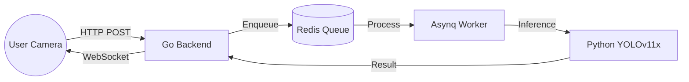

# CrashStream - Real-time AI Accident Detection


**CrashStream** is a high-performance, distributed system designed for real-time traffic accident detection. By leveraging state-of-the-art computer vision (YOLOv11x) and a decoupled microservices architecture, it provides sub-second detection and alerting from standard camera feeds.

---

## Architecture

The system is designed for scalability and low latency:

-   **Frontend (Go/SSR)**: Captured frames from mobile/web clients and displays real-time visual overlays (bounding boxes) via WebSockets.
-   **Ingestion Engine (Go)**: A high-throughput Gin server that receives frames and enqueues them into a persistent Redis queue.
-   **Asynq Orchestrator**: Manages background task distribution, ensuring reliable delivery of frames to the inference engine.
-   **Inference Service (Python/FastAPI)**: Runs a custom-tuned YOLOv11x model for accurate accident detection and coordinate extraction.



---

## Key Features

-    **Real-time Bounding Boxes**: Visual representation of detected accidents drawn directly over the live video.
-    **Smart Thresholding**: Configurable confidence filtering (currently set to **0.65**) to eliminate false positives.
-    **Decoupled Processing**: Asynchronous architecture prevents backend bottlenecking during high frame-rate streaming.
-    **Mobile Optimized**: Support for mobile camera access and responsive UI.

---

## Quick Start

### Prerequisites
-   Docker & Docker Compose
-   Custom weights (`epoch61.pt`) placed in the model project directory.

### Launch
Clone the repository and run:

```bash
docker-compose up --build -d
```

### Accessing the Portal
-   **Laptop**: Visit `http://localhost:8080`
-   **Mobile**: Visit `http://<YOUR_IP>:8080` (requires [Secure Context Workaround](https://developer.mozilla.org/en-US/docs/Web/Security/Secure_Contexts))

---

## Monitoring

Monitor the AI inference scores and system health in real-time:

```bash
# View AI Detection Logs
docker-compose logs -f python-backend

# View All System Logs
docker-compose logs -f
```

---

## Tech Stack

-   **Languages**: Go 1.24, Python 3.10
-   **Frameworks**: Gin (Go), FastAPI (Python), Ultralytics (YOLO)
-   **Infrastructure**: Redis, Docker, Asynq

---

## License
Built for real-time safety monitoring. [Akshansh - 2026]